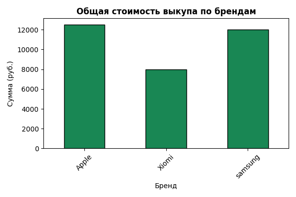

 (Electronics Tracker)

Электро-Трекер — это полноценное веб-приложение для комиссионных магазинов и сервисных центров. Оно позволяет вести учет выкупаемой электроники, автоматически рассчитывать рекомендованную стоимость выкупа на основе состояния устройства и строить наглядную аналитику по брендам.


 Основной функционал

CRUD-операции: Добавление, просмотр и удаление устройств из базы данных.
Умный расчет: Автоматическое вычисление цены выкупа (базовая цена × модификатор грейда состояния).
Аналитика в реальном времени: Генерация графиков распределения бюджета по брендам «на лету».
Админ-панель: Встроенная система управления справочниками (грейдами состояний).

 Стек технологий

Backend: Python 3, Django
База данных: SQLite (для локальной разработки)
Аналитика и графики: Pandas, Matplotlib
Frontend: HTML5, Bootstrap 5
Контроль версий: Git, GitHub


Скриншоты интерфейса


 
График аналитики, сгенерированный с помощью Pandas и Matplotlib


Инструкция по локальному запуску

Для запуска проекта на вашем компьютере выполните следующие шаги:

1. Клонируйте репозиторий:
```bash
   git clone [https://github.com/Lindo47/tracker.git](https://github.com/Lindo47/tracker.git)
   cd tracker
